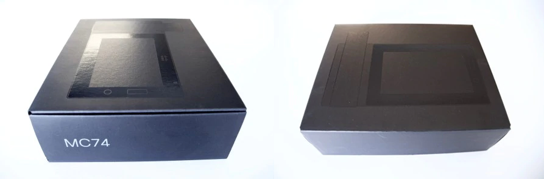
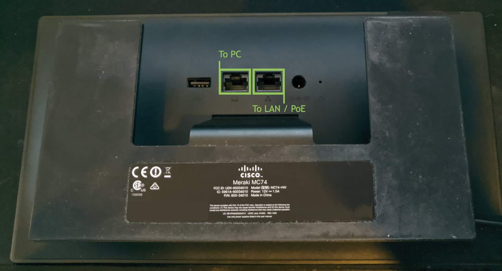
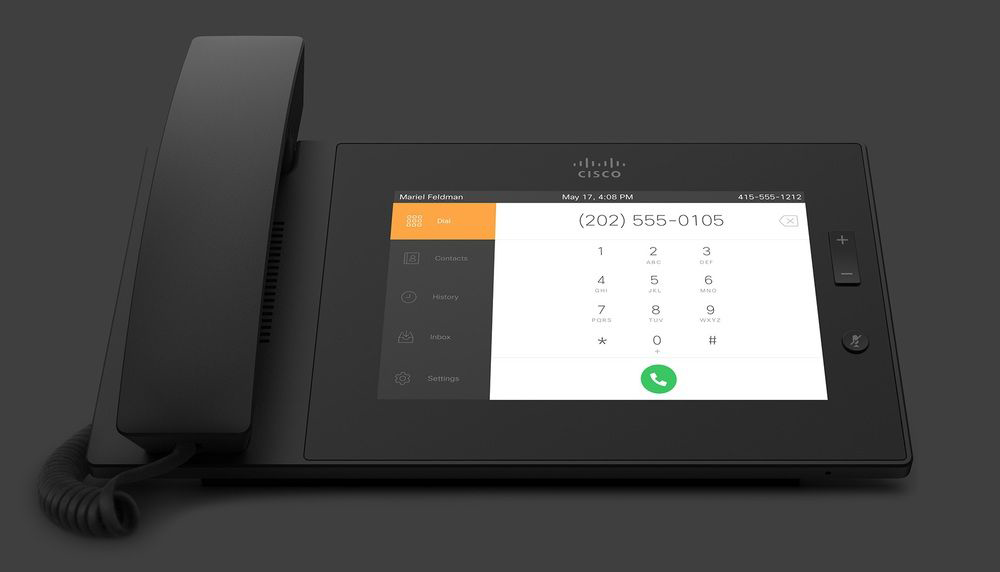

# Some background information for the uninitiated
Incase you *don't* know much about the Meraki MC74, I'll be covering some background on the phone regarding it's lifespan, history, and etc.

If you're already up to speed, or you just don't care, you can skip to [configuration](config.md).

#### What's in the box?

>Yes, I shamelessly stole these images from Cisco Meraki's [blog](https://meraki.cisco.com/blog/tag/mc74/), where else would I find them?

A typical in-box unit came with the following;

>This one too! One of my favorite images they took, personally!

Usually including the device, handset, wall-mount bracket, screws, flat-style ethernet cable, cleaning cloth, and warranty / information regarding setup.
>Note, that typically on eBay, units do not come in box. I got extremely lucky with my first unit as it came with it's original box, mounting hardware, etc.

On the back of the unit, there are two ports;

- One indiciating the connection to your PC in a pass-through configuration.
- And Another, indicating a LAN connection (PoE-input if your setup supports it.)

The device runs Android 4.2.3, Jellybean under the hood. 
 Little old, but still runs great on the hardware for it's age!

#### What was the original usage / usecase?

Before Cisco Meraki decided to end support for the MC74, it was cloud managed via their MDM portal.

 Overall, setup was pretty painless, plug it in, provision and off to the races. Nothing special here.

The dialer, device settings, and etc. were all within their in-house application.

"Escaping" from this application was practically impossible. Everything was configured from within the app, so there was no reason to leave it to go to system settings, or any other application.

#### Well, what happened?

After their attempt to break market, Cisco Meraki found their product to be "not good enough" and pulled it from their device catalog and ended support. Not entirely sure why, but that pretty much sealed the deal on the product.

They originally sold for over $500/unit. Which was a bit pricy, and probably didn't help sales.

Now you can find them on [eBay](https://www.ebay.com/itm/Cisco-Meraki-MC74-Cloud-Managed-VoIP-PoE-Phone-Touchscreen-600-34010/333580099192?) for like $20 a unit, now that's more my speed.

That brings us to now, where we needed a solution to continue using these phones. 
 From this point, they were pretty much paperweights! No management portal means no means of provisioning!