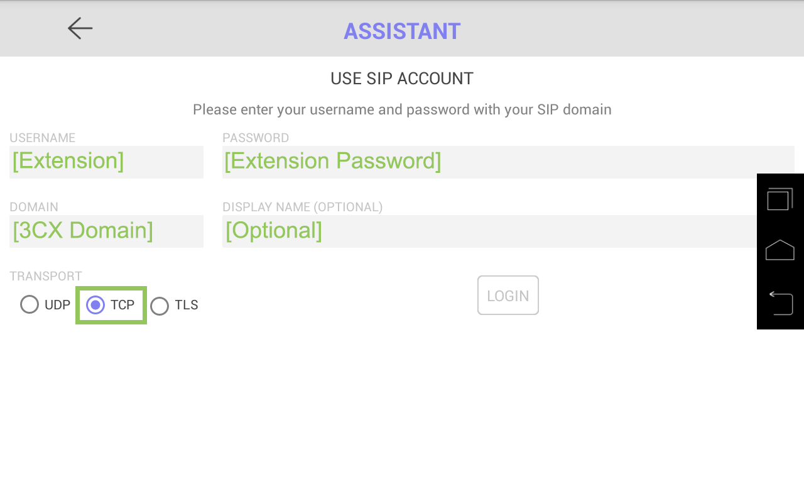
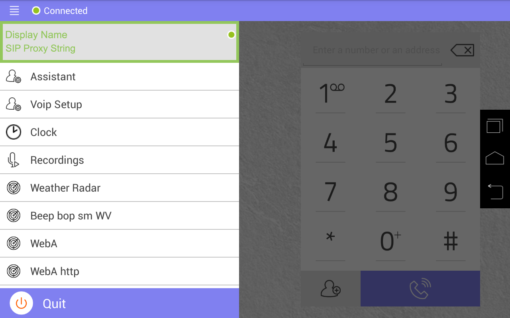
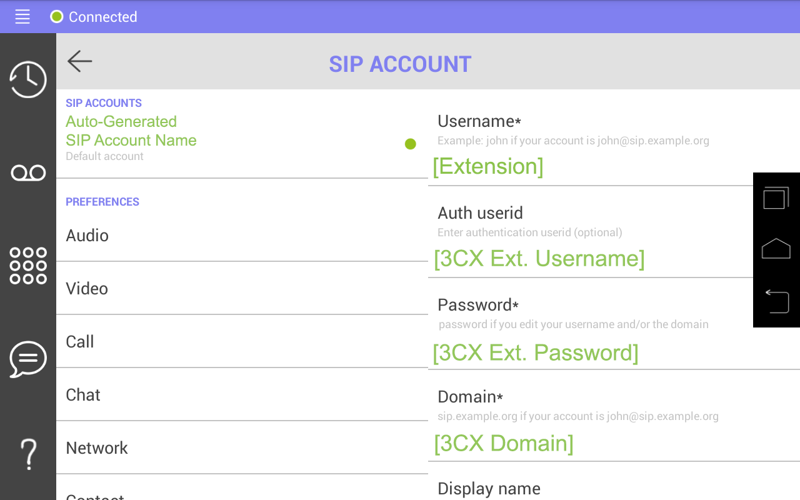
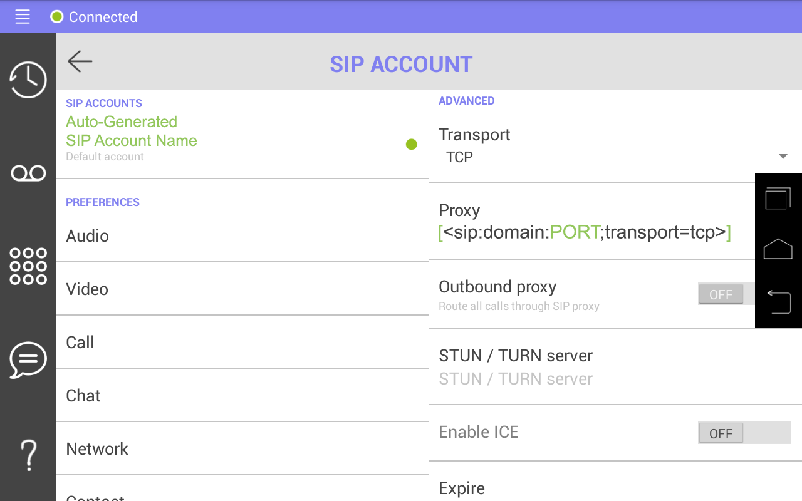

# Configuration of wPhone (LinPhone) for various SIP/PBX systems

#### So, you've got a modded phone, now what?

You've opened up a multitude of possibilities for your shiny new Meraki-MC74 by successfully getting here!
 There's so many options to focus on, but primarily, I'm going to focus on configuring the wPhone (LinPhone) application for communication with a SIP/PBX server.

#### Configuring wPhone to communicate with a 3CX SIP server:

Now, I understand that *not everyone uses 3CX* but I prefer it over most other SIP / PBX servers as it's easy to configure and the license is pretty much free to use.

1. Open the `wPhone` application. It should present you with an assisted menu to put your credentials into.

> Your credentials are translated as presented below:
    - `Username: Extension (001)`
    - `Password: Extension Password (NOT YOUR 3CX PASSWORD)`
    - `Domain: Your 3CX domain ({yourname}.3cx.us, 192.168.1.x, voip.phoenix.lab)`
    - `Display Name: Optional, but looks nice in the side-bar as a title.`
    - `Transport: TCP (Or TLS if you have that configured.)`
2. Now, it won't work out of the box, because 3CX is special, so hit the hamburger button in the upper-left corner and tap your display name. It should open a menu titled `SIP ACCOUNT`.

3. On the right, under `Auth userid` put your extension username.

4. Under `Proxy` add your SIP port after your domain so it looks something like:

5. Under `Prefix` remove the prefix, otherwise it'll try to dial with a +1 on everything.

6. Switch to the `Call` tab.
7. Configure a ringtone, or don't. I don't care.
8. Switch to the `Audio` tab.
9. Go ham, turn on all the codecs.

10. In 3CX, under the extension, and under `Phone Provisioning` scroll to the bottom and look under codecs.
11. Click `Add codecs` and add them all.
12. On the phone again, press the dialpad button and tap the status indicator next to the hamburger icon, this instructs it to attempt to connect.

It should connect if your setup matches mine. Congratulations!

#### Configuring wPhone with a Asterisk SIP/PBX server:

I don't have one of these, but I'm sure one of you out there do, so please message me with further information. I'll add it once I get a confirmed setup!