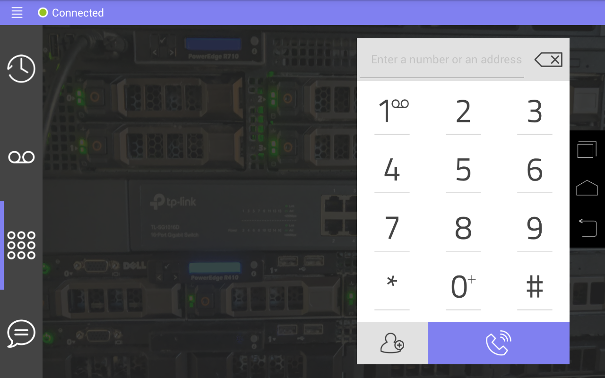

# Time to make your phone look pretty!

After doing all of that work, I'm sure you're dying to know if you can set custom ringtones, backgrounds, etc.
**Well, the answer is yes, absolutely!**

After completing intial configuration, (i.e. Connecting to a SIP/PBX server, ensuring phonecalls can be recieved and made, etc.) you can further customize and brand your phone in the following ways:

- You can change the ringtone to be any `.ogg` file, just use an online converter to convert it!
- You can change the background on the dialer, as well as the clock to be whatever you want.
- You can change the timeout before the phone transitions to clock-mode, and idle/sleep mode.

#### Changing the ringtone

To change the ringtone, perform the following steps;

1. **Ensure** your ringtone of choice is in the `.ogg` file format, as other formats are untested.
> If your ringtone is not in the `.ogg` file format, you can convert it using a tool, like [this one](https://audio.online-convert.com/convert-to-ogg).
2. Establish an ADB connection to your phone, note that the location we will be using to store your ringtone will be `/sdcard/ssm/audio/`.
3. Copy your desired ringtone from your PC to your phone using the following command:  `adb shell push /path/to/ringtone.ogg /sdcard/ssm/audio/ringtone.ogg`
4. Pull the configuration file from the phone using the following command:  `adb shell pull /sdcard/ssm/store/MC74.mp C:/path/to/desired/location/MC74.mp`.
> Now's a great time to remove the old `MC74.nob` if you've previously modified your phone and you're updating / now customizing.  Run: `adb shell rm /sdcard/ssm/store/MC74.nob`
5. Open up your text editor of choice, and locate the line that says  `ringtone: '/system/media/audio/ringtones/Trad.ogg'` and change it to  `ringtone: '/sdcard/ssm/audio/yourringtone.ogg'`
6. Now push it back to the phone: `adb shell push C:/path/to/desired/location/MC74.mp /sdcard/ssm/store/MC74.mp`.
7. Reboot your phone, *or* force-close and reopen wPhone from your home menu. Your changes should now be applied.

#### Changing the wallpaper

To change the wallpaper behind the dialer, perform the following steps;

1. **Ensure** your wallpaper is in `16:9` and at least 720p (1280x720).
2. Establish an ADB connection to your phone, note that the location we will be using to store your wallpaper will be `/sdcard/ssm/image/`
3. Copy your desired wallpaper from your PC to your phone using the following command:  `adb shell push /path/to/wallpaper.png /sdcard/ssm/image/wallpaper.png`
4. Pull the configuration file from the phone using the following command:  `adb shell pull /sdcard/ssm/store/MC74.mp C:/path/to/desired/location/MC74.mp`
5. Open up your text editor of choice, and locate the line that says  `bg: 'whiteSlate.jpg'` Change that to `bg: 'wallpaper.png'`
>Note: To also change the wallpaper on the clock, find `img: "row.jpg"` under `screensaver:` and change it out with `img: "wallpaper.png"`
6. Push the configuration file from your PC to your phone using the following command:  `adb shell push C:/path/to/desired/location/MC74.mp /sdcard/ssm/store/MC74.mp`
7. Reboot your phone, *or* force-close and reopen wPhone from your home menu. Your changes should now be applied.

#### Changing the clock/sleep timers

To change the clock/sleep timers, perform the following steps;

1. Establish an ADB connection to your phone.
2. Pull the configuration file from the phone using the following command:  `adb shell pull /sdcard/ssm/store/MC74.mp C:/path/to/desired/location/MC74.mp`
3. Open up your text editor of choice, and locate the line(s) that say  `lightSleep: '600'`  and `deepSleep: '1200'`
4. Change them as desired, I personally recommend 10 minutes (600) lightSleep, and 60 minutes (3600) deepSleep.
5. Push the configuration file to the phone using the following command:  `adb shell push C:/path/to/desired/location/MC74.mp /sdcard/ssm/store/MC74.mp`
6. Reboot your phone, *or* force-close and reopen wPhone from your home menu. Your changes should now be applied.

