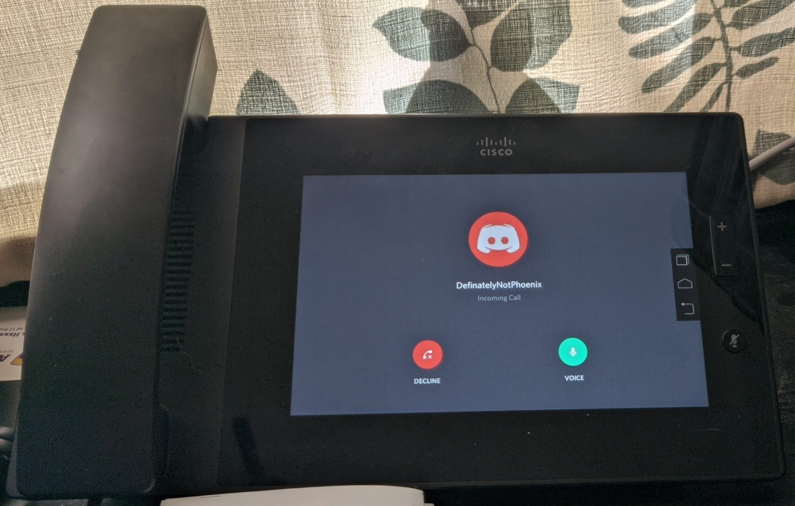

# Some extra additional modifications for ease of use, etc.
Now for the fun little tid-bits that I added to my phone for some added flare

#### Installing Discord, because, why not?

I wondered, like most of you are, if you can make this thing a "Discord Phone" because everyone needs one of those, right?

OF COURSE YOU CAN! It's a bit insecure since it's an older build of Discord, but it works!

**To install, perform the following:**

1. Ensure the phone is connected to your PC via USB.
2. Ensure you have ADB access to your phone.
3. Download the following [APK](https://www.apkmirror.com/apk/discord-inc/discord-chat-for-gamers/discord-chat-for-gamers-9-8-8-hotfix-release/discord-chat-for-gamers-9-8-8-hotfix-android-apk-download/) from APKMirror, this is the only version, and highest version compatible to-date.
4. Install by running the following via adb: `adb install {path/to/apk}`
5. Open, sign in, and voila, Discord Phone.

#### Installing Tasker to automate quiet time

Let's say, you're sleeping, and some douchebag decides to call you at 2AM on your SIP number. (Totally not me, I setup after-hours rules.)
 There's a way to silence the phone for off-hours. Especially useful if you don't have a PBX and have your phone setup right to your SIP provider.

**Preparations:**

1. Ensure the phone is connected to your PC via USB.
2. Ensure you have ADB access to your phone.
3. Download the following [APK](https://www.apkmirror.com/apk/joaomgcd/tasker/tasker-4-9u4-release/) from APKMirror, we will be using Tasker.
4. Install by running the following via adb: `adb install {path/to/apk}`
5. Open Tasker.
6. Make a new profile by pressing the `+` icon in the middle.
7. Press `Time`.
8. Set your range for when you want the phone to be muted.
9. Go back. (Upper Left Hand Corner)
10. Press `New Task`.
11. Type in a name, `Silence`.
12. Add an action by pressing the `+` icon in the middle.
13. Under `Audio` select `Silent Mode`.
14. Toggle the state to `On`.
15. Go back, and repeat steps 6 through 14 but respectively for a `Audible` profile.

Ta-da, automated sound profiles for when you're sleeping and working!

#### Softkeys, because physical buttons blow.

1. Ensure the phone is connected to your PC via USB.
2. Ensure you have ADB access to your phone.
3. Download the following [APK](https://github.com/dogusumit/SoftKeys2-HomeBackButton) from Github, we will be using SoftKeys2.
4. Install by running the following via adb: `adb install {path/to/apk}`
5. Open the application, and follow the on-screen prompts.
>I Personally recommend putting them to the right and shrinking the bar to be about the size mine is in the Discord photo above.

Bam, no more using commands to access the home button!

